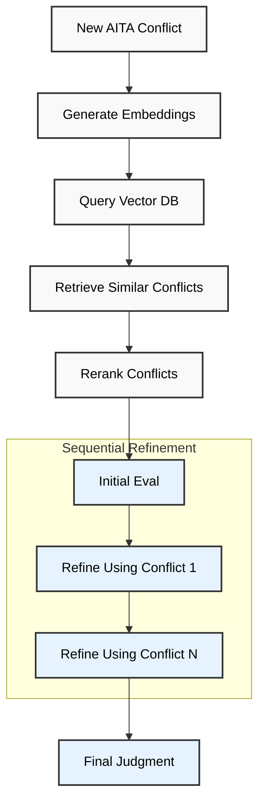

# AITA Judge Agent 🤖⚖️

An LLM agent that evaluates "Am I The A**hole" (AITA) conflicts with a nuanced understanding that is backed by real-life evidence.

## 🌟 Overview

This agent leverages [RAG (Retrieval-Augmented Generation)](https://docs.llamaindex.ai/en/stable/understanding/rag/) to analyze AITA scenarios by drawing insights from a database of nearly 40k conflicts sourced from the [r/amithea**hole](https://www.reddit.com/r/AmItheAsshole/) subreddit.

The [dataset](https://huggingface.co/datasets/MattBoraske/reddit-AITA-submissions-and-comments-multiclass) of AITA conflicts is available on HuggingFace.

## 🛠️ Technical Architecture

Under the hood, the agent is implemented as a [llamaindex workflow](https://docs.llamaindex.ai/en/stable/module_guides/workflow/) that progressively refines its judgment:

1. The agent is passed a new conflict.
2. Similar conflicts are retrieved from the AITA database.
- **Embeddings**: OpenAI's [`text-embedding-3-small`](https://platform.openai.com/docs/guides/embeddings/) model
- **Vector Storage**: [Pinecone](https://www.pinecone.io/) vector store.
- **Reranking**: [Cohere's reranker](https://cohere.com/rerank) for enhanced relevance
1. The agent is given the top-ranked retrieved conflict and uses it as context when evaluating the input conflict.
2. The agent is subsequentally given the conflict and uses it to refine its existing answer. 
3. The process continues until all retrieved contexts are considered.

## 🔄 Workflow Visualization

## ⚡ Usage

To use locally, set your API keys in a .env file in the root directory. At minimum, you need API keys for OpenAI, Cohere, and Pinecone.

### Currently Supported Providers

| Provider | LLM | Embeddings | Reranker | Vector Store | Environment Variable |
|----------|-----|------------|-----------|--------------|---------------------|
| OpenAI | ✅ | ✅ | ❌ | ❌ | `OPENAI_API_KEY` |
| Grok | ✅ | ❌ | ❌ | ❌ | `GROK_API_KEY` |
| Cohere | ❌ | ❌ | ✅ | ❌ | `COHERE_API_KEY` |
| Pinecone | ❌ | ❌ | ❌ | ✅ | `PINECONE_API_KEY` |

## 🚀 Deployment

Deployment using [llama-deploy](https://github.com/run-llama/llama_deploy) is a WIP.
